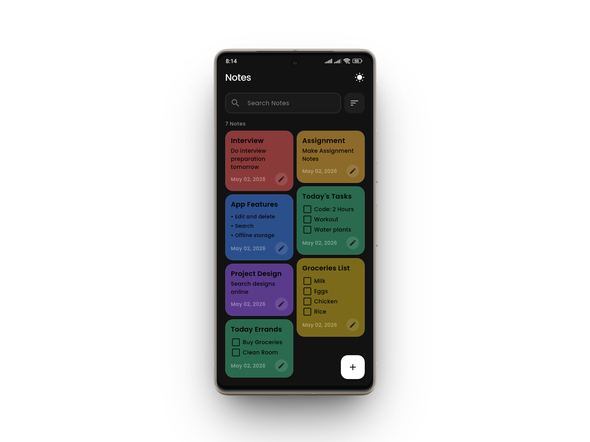
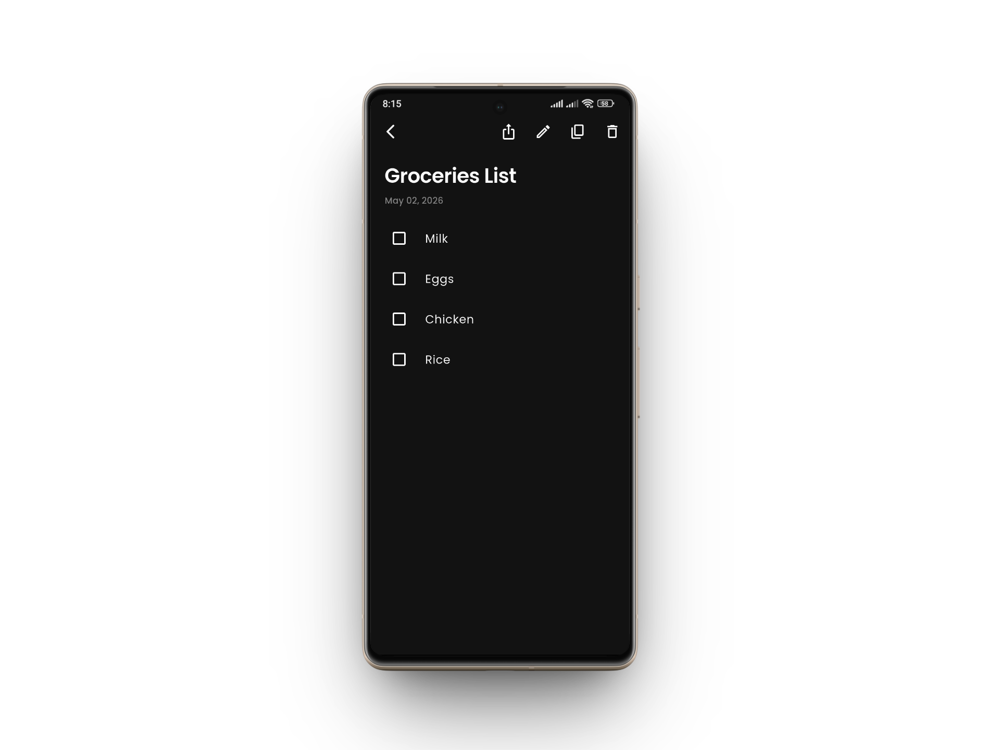
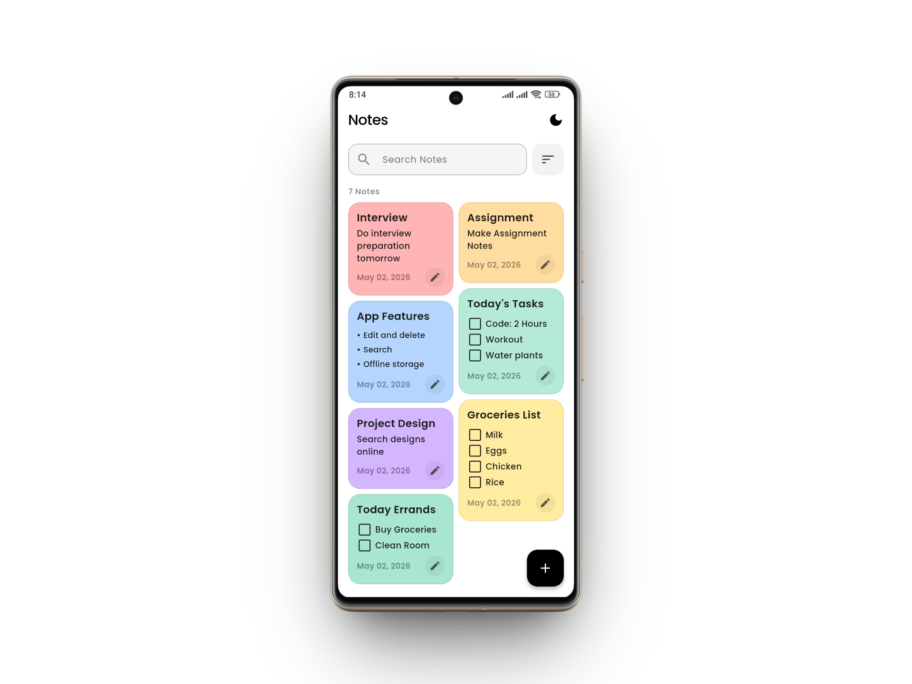
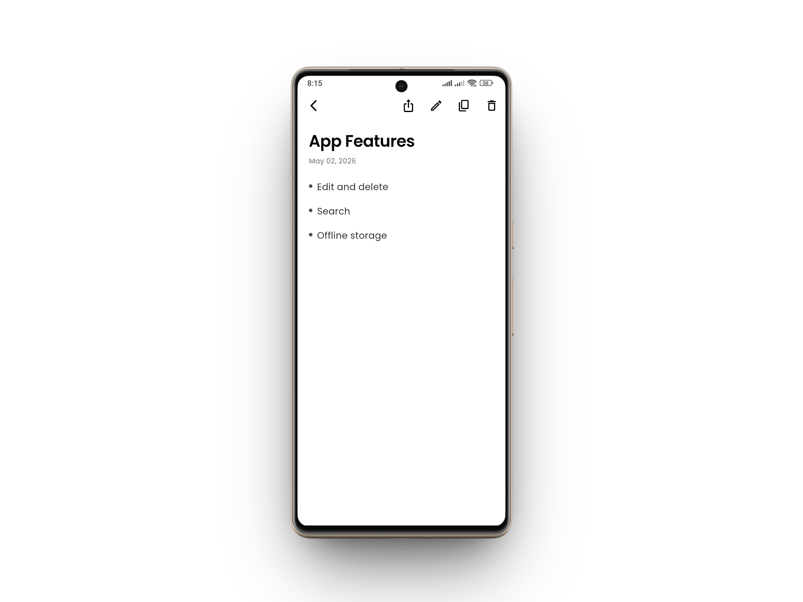
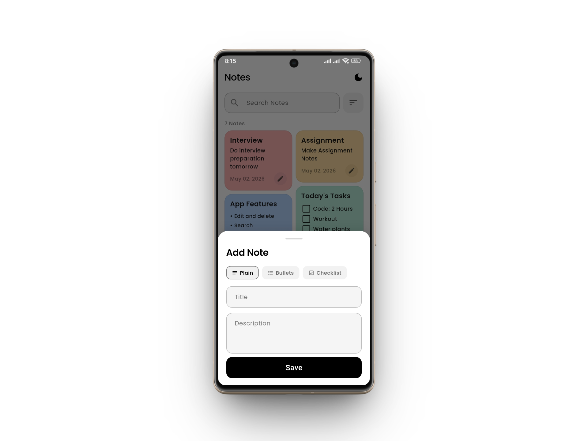
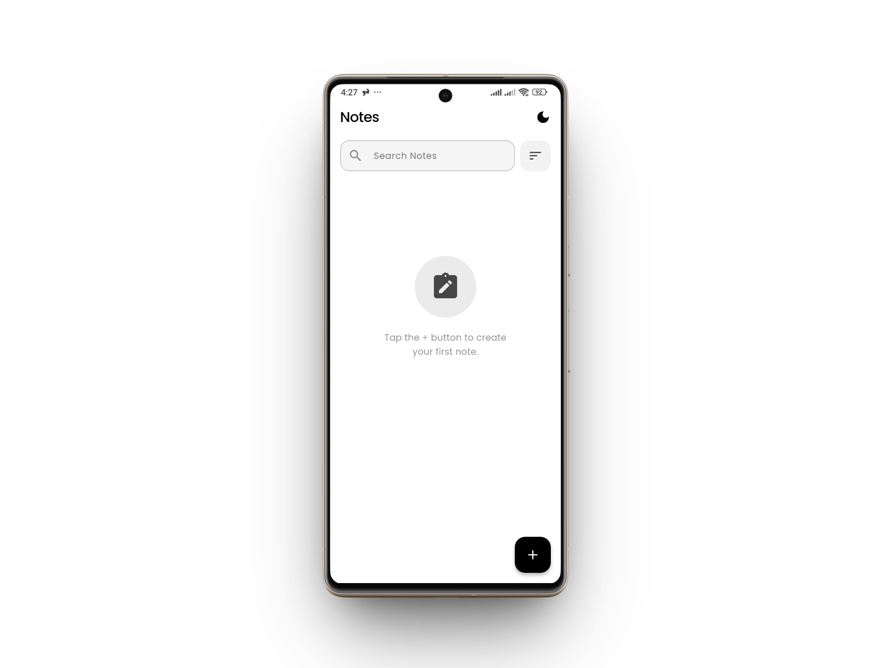

# Flutter Notes App

A feature-rich, aesthetically crafted notes application built with Flutter, inspired by a Dribbble monochromatic design system. This project features a clean architecture, local persistence with Hive, and a dynamic masonry grid layout.

---

## Design Inspiration

This project is inspired by a clean, monochromatic mobile app design found on Dribbble. It prioritizes high contrast, minimalist typography, and subtle pastel accents for a premium user experience.

- **Design Reference**: [Dribbble - Notes App](https://dribbble.com/shots/11875872-A-simple-and-lightweight-note-app)

### Preview


---

## App Preview

| | |
| --- | --- |
|  |  |
|  |  |
|  |  |

---

## Overview

This app lets users create, edit, delete, search, and sort notes with support for plain text, bullet lists, and interactive checklists. The UI follows a strict monochromatic aesthetic with colorful pastel card accents, utilizing a staggered grid layout for a modern feel.

---

## Features

### Notes Management

- **CRUD Operations**: Full Create, Read, Update, and Delete functionality.
- **Rich Content**: Support for plain text, bullet points, and interactive checklists.
- **Actions**: Copy note content to clipboard and share notes via the system share sheet.

### Search and Sort

- **Real-time Search**: Instant full-text search across titles and descriptions.
- **Smart Sorting**: Sort by Newest, Oldest, or Alphabetically (A-Z, Z-A).
- **Contextual Menu**: Quick access to sort options via a sleek popup menu.

### UI and Design

- **Masonry Grid**: Dynamic staggered layout using `flutter_staggered_grid_view`.
- **Monochromatic Theme**: Professional Black & White design system with Dark and Light mode support.
- **Animations**: Hero transitions for note titles and smooth `AnimatedSwitcher` for theme toggles.
- **Typography**: Uses the **Nunito** font family for a clean, readable experience.
- **Empty State**: Custom empty state illustrations and prompts.

### Persistence

- **Local Storage**: Powered by **Hive** for high-performance local persistence.
- **Theme Persistence**: Dark/Light mode preference is saved across app restarts.
- **UUIDs**: Reliable note identification using the `uuid` package.

---

## Tech Stack

| Package | Version | Purpose |
| --- | --- | --- |
| `flutter` | `sdk: flutter` | UI framework |
| `provider` | `^6.1.5+1` | State management |
| `hive_flutter` | `^1.1.0` | Local persistence |
| `hive_generator` | `^2.0.1` | Hive model code generation |
| `build_runner` | `^2.4.13` | Generation tool |
| `uuid` | `^4.5.3` | Unique note identifiers |
| `intl` | `^0.20.2` | Advanced date formatting |
| `flutter_staggered_grid_view` | `^0.7.0` | Masonry/staggered grid layout |
| `share_plus` | `^13.1.0` | Native share sheet integration |

---

## Project Structure

```text
lib/
├── main.dart            # App entry point & provider initialization
├── core/
│   ├── constants/       # App-wide sizes and spacing (sizes.dart)
│   └── theme/           # Design system (app_theme.dart, colors.dart)
└── features/
    └── notes/
        ├── models/      # Hive models & TypeAdapters (notes.dart)
        ├── providers/   # State management (notes_provider.dart)
        ├── screens/     # UI Pages (Home, Detail, Add, Splash)
        ├── utils/       # Global helpers (note_actions.dart)
        └── widgets/     # Specialized UI components (Cards, Editors, Menus)

```

---

## Getting Started

### Prerequisites

- Flutter SDK (Used 3.41.6)
- Dart SDK (Used 3.11.4)
- A connected device or emulator

### Setup

```bash
# 1. Clone the repository
git clone https://github.com/sabihaniaz7/Notes-App-Flutter.git
cd Notes-App-Flutter

# 2. Install dependencies
flutter pub get

# 3. Generate Hive adapters
dart run build_runner build --delete-conflicting-outputs

# 4. Run the app
flutter run
```

### Hive Initialization Example

```dart
import 'package:hive_flutter/hive_flutter.dart';
import 'package:notes_app/features/notes/models/notes.dart';

void main() async {
  WidgetsFlutterBinding.ensureInitialized();
  await Hive.initFlutter();
  Hive.registerAdapter(NotesAdapter());
  await Hive.openBox('notes');
  runApp(const MyApp());
}
```

---

## Design System

The app follows a **Monochromatic Aesthetic**, using strict Black and White as the primary colors. Pastel colors are used sparingly for note cards to provide visual distinction without breaking the clean look. All design tokens (spacing, typography, radii) are centralized in `lib/core/theme/app_theme.dart`.

---

## Known Limitations

- **Platform Setup**: Native sharing via `share_plus` requires specific configuration for iOS and Android in their respective project directories.
- **Model Changes**: Any changes to the `Notes` model require a re-run of the `build_runner` command to update the generated adapters.
- **Platform Compatibility**: Currently built and tested exclusively on Android devices.
